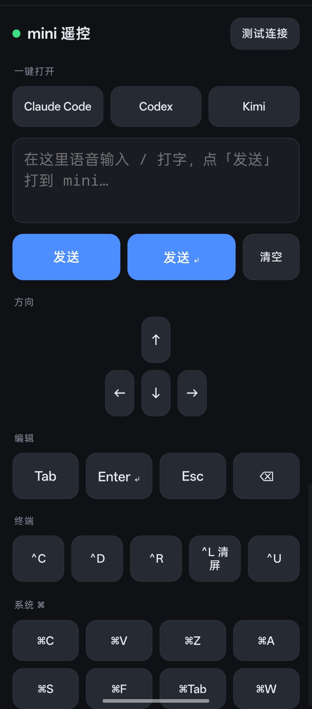

# phone-remote

[English](README.md) | **简体中文**

把手机变成 Mac 的无线键盘 + 快捷键遥控面板。

手机浏览器打开一个网页，文本框里用**手机自带输入法（含语音）**打字，方向键 /
Tab / Ctrl+C / ⌘ 组合做成按钮。指令经局域网或 Tailscale 送到 Mac，在本机合成
真实键盘事件，打进当前最前面的窗口。

<p align="center">
  
  <br>
  <em>添加到主屏幕后全屏运行的样子。按钮都是普通 HTML，想加想改都很容易。</em>
</p>

## 解决什么问题

用远程桌面类工具操作另一台 Mac 时，**语音输入打不进去**：远程软件转发物理按键
没问题，但对输入法合成（IME composition）那一层的转发普遍很差，中文尤其，说了
半天字进不去。

phone-remote 绕开这条路——不做跨会话转发，而是**在目标 Mac 本机注入**。远程桌面
只负责「看画面」，手机负责「打字」，两条道分开。中文和组合键都正常。

手机端不用装 App：就是个网页，「添加到主屏幕」之后带自己的图标全屏运行，iPhone
和安卓可以同时用同一套。

## 安装

```bash
git clone https://github.com/<你>/phone-remote.git ~/Projects/phone-remote
cd ~/Projects/phone-remote
./install.sh
```

`install.sh` 会在 `~/Applications` 里构建一个签名的 `.app` 包装器、装好
LaunchAgent（开机自启、崩溃自动重启）并启动服务。零 npm 依赖，只用 Node 标准库。

想前台跑：

```bash
node server.js     # 会打印带 token 的手机访问地址
```

### 唯一需要手动点一次的：辅助功能授权

合成键盘事件需要「辅助功能」权限，macOS 是**按可执行文件**授权的：

> 系统设置 → 隐私与安全性 → 辅助功能 → **+** → 应用程序 → **Phone Remote** → 打开开关

然后 `launchctl kickstart -k gui/$(id -u)/<label>` 重启一下。没授权之前，
`/type` 和 `/key` 会返回 `不允许发送按键 (1002)`。

**为什么要包一层 .app**：macOS 按可执行文件授权，若 launchd 直接指
`/opt/homebrew/bin/node`，一来这个隐藏路径在授权面板里很难选，二来 Homebrew
升级 node 后 Cellar 路径变化会让授权失效。包成签名 .app 后身份稳定、列表里一眼
能找到。

## 手机端怎么用

启动日志（`~/ops-logs/phone-remote/stdout.log`）里会打印带 token 的地址：

```
http://100.x.y.z:8787/?t=<token>
```

手机上打开它（走 Tailscale，或同一局域网用 `<your-mac>.local:8787`），然后
**添加到主屏幕**——就成了一个全屏 App，token 带在里面，点开即用。

用之前确认 Mac 最前面的窗口就是你要输入的地方。

## 自定义按钮

按钮就是 `index.html` 里的普通 HTML：

```html
<button onclick="key('ctrl-r')">^R</button>
```

`key()` 接受 `server.js` 里 `KEYS` 白名单中的任意名字；要加新键就在那张表里加一行
（`{ code: <AppleScript key code> }` 或 `{ char: "x", mods: ["cmd","shift"] }`）。

## 安全

- 只监听局域网 / Tailscale，**绝对不要把这个端口转发到公网**。能连到端口且拿到
  token 的人 = 拿到你的键盘。
- 所有注入接口都校验 token，存在 `.token`（已 gitignore、权限 600、首次运行自动
  生成）。没 token 一律 401。
- 用户输入绝不拼进 shell 或 AppleScript 命令：文本经临时文件中转、用
  `read POSIX file … as «class utf8»` 读取，快捷键走固定白名单，没有注入面。

## 已知限制

- 文本注入走剪贴板（临时文件 → 剪贴板 → ⌘V），所以会**覆盖 Mac 当前剪贴板内容**。
- 刻意不用 `pbcopy`：在非 Aqua / 后台会话里它连不到 GUI 剪贴板，**写入看似成功、
  `pbpaste` 读回是空的**（实测踩过）。`osascript` 的 `the clipboard` 走 AppKit 正常。
- 按键打进最前面的窗口——要是别的 App 抢了焦点，键就打给它了。

MIT 协议。
